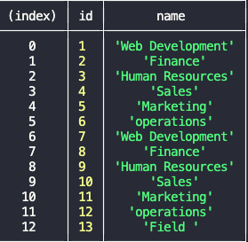

# Title : company-management-system


As a company administrator I can view, manage departments, roles, and employees in my company to organize a business database.

## Technologies 🖥

Inquirer package, Mysql2, Node.js and JavaScript

## Installation 🔍

```
git clone git@github.com:roxywasiak/company-management-system.git

cd company-management-system

npm run start
```

## Screenshots 📸

All employees table


All departments table



## Video link to project 📽

Watch the video walk-through of the application [CLICK](https://drive.google.com/file/d/1yyTkVKlGDMZQSo2qNu-Y8wVQpyqYChON/view?usp=sharing)

# Contact Me 👋

## If you require more information about this application just drop me an [email](mailto:ruksclone@hotmail.com).
